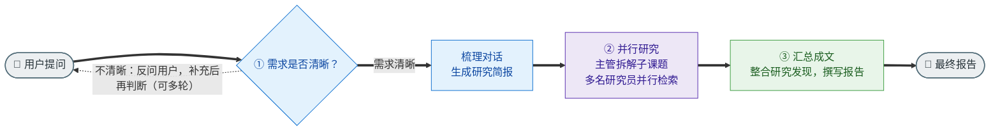
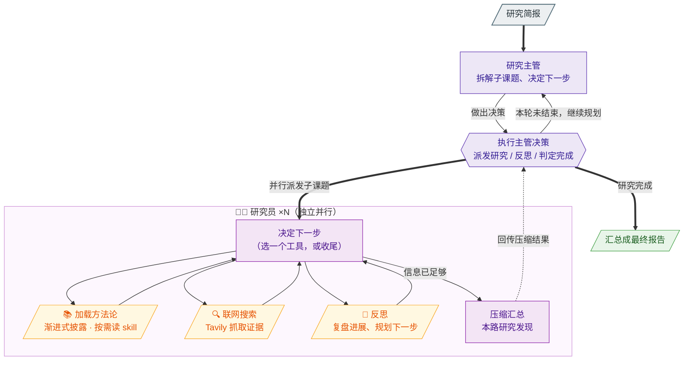

# 🧱 Deep Research Agent

一个用 [LangGraph](https://langchain-ai.github.io/langgraph/) 搭建的**深度研究智能体**：给它一个开放式问题，它会先澄清研究范围，再把任务分解成多个子课题并行检索，最后汇总成一份结构化报告。

整个系统围绕一个核心理念——**Skills 渐进式披露（progressive disclosure）**：研究员不把全部领域知识硬塞进 system prompt，而是先看到一份精简的方法论索引，真正动手前再用工具按需加载对应的研究方法论。这样既省上下文，又能让不同类型的问题（学术、新闻、人物、产品）走各自最合适的检索套路。

---

## 🧭 整体架构

研究任务被拆成三个阶段，串成一条端到端流水线：



1. **Scope（范围界定）** — 判断问题是否含糊、是否需要向用户追问澄清，并把多轮对话转写成一份明确的**研究简报（research brief）**。
2. **Research（研究）** — supervisor 把简报拆成若干互不重叠的子课题，用 `ConductResearch` 工具**并行**派发给多个 skills 研究员；每个研究员上下文隔离，独立走「**加载 skill → Tavily 检索 → 反思 → 压缩**」的循环。
3. **Write（成文）** — 汇总各路研究结果，生成最终报告。

其中 **Research（研究）阶段**内部是「主管调度 + 研究员循环」的双层结构，单独展开如下：



### LangGraph 图入口

`langgraph.json` 注册了 4 张可独立运行的图，便于分阶段调试：

| 图名 | 说明 | 实现文件 |
|---|---|---|
| `scope_research` | 仅范围界定阶段 | `research_agent_scope.py` |
| `research_agent_skills` | 单个 skills 研究员（检索 + 压缩循环） | `research_agent_skills.py` |
| `research_agent_supervisor` | supervisor 并行调度多个研究员 | `multi_agent_supervisor.py` |
| `research_agent_full` | Scope → Research → Write 端到端全流程 | `research_agent_full.py` |

---

## ✨ 核心特性

- **Skills 渐进式披露**：研究员先看到 skills 索引（仅 name + description），需要时用 `load_skill` 工具加载完整方法论正文（见 `skills/*.md`）。
- **多智能体并行**：supervisor 把子课题并行派发给多个研究员，各研究员上下文隔离、互不干扰，显著缩短深度研究的墙钟时间。
- **可配置模型路由**：每个逻辑角色（SCOPING / RESEARCHER / SUPERVISOR / SUMMARIZATION / COMPRESSION / FINAL_REPORT）都能独立指定模型、端点与 key。同一套图可无缝对接 OpenAI、Anthropic 或任意 OpenAI 兼容网关（详见 `model_config.py`）。
- **稳健性设计**：结构化输出带回退重试（`structured_output_fallback.py`）、Tavily 瞬时故障多级退避重试、网关 RPM 限速（`AGENT_RPM`，避免并发洪峰触发 WAF 封禁）。
- **评估闭环**：scoping / research / supervisor 三套基于 LangSmith 的评估脚本，每套含「上传数据集 / 跑评估 / 回读结果」三件套。

### 内置 Skills

| Skill | 适用场景 |
|---|---|
| `academic-research` | 学术/科研类（论文、综述、研究方法、引用追溯） |
| `news-timeline` | 时事/事件时间线（持续发酵的新闻、产品迭代史、政策序列） |
| `people-research` | 人物背景调研（履历、代表作、近况、所在机构） |
| `product-comparison` | 产品/服务横向对比（在多个候选间做选择） |

新增一个 skill 只需在 `skills/` 下放一个带 YAML frontmatter 的 markdown 文件（`name` 字段须与文件名主干一致），import 时会被自动扫描收录，无需改代码。

---

## 📚 示例

[`examples/`](examples/) 收录了由 `research_agent_full` 全流程**自动生成**的完整示例报告，每份都附「**决策与执行轨迹**」——逐一记录 Scope 的研究简报、Supervisor 的拆解/并行调度决策、以及每个研究员加载了哪个 skill、搜了哪些 query。

| 示例 | 看点 |
|---|---|
| [DeepSeek 360° 全景调研](examples/deepseek-360.md) | 一题拆成 3 路并行，3 名研究员分别路由到 `academic-research` / `people-research` / `product-comparison` 三个不同 skill |
| [冰岛自驾环岛 8 天规划](examples/iceland-self-drive.md) | 拆成「行程+景点」「自驾+住宿」2 路并行，输出带 `[N]` 引用的可执行规划 |

一键复现或跑自己的主题：`uv run python examples/run_example.py --slug deepseek-360`（详见 [examples/README.md](examples/README.md)）。

---

## 🧪 评估

流水线的三个环节各有一套基于 [LangSmith](https://smith.langchain.com/) 的评估，**每套沿两个轴打分**——一轴看「覆盖/正确」，一轴看「质量/可信」：

| 评估层 | 轴 A · 覆盖 / 正确 | 平均分 | 轴 B · 质量 / 可信 | 平均分 |
|---|---|:---:|---|:---:|
| **Scoping**（需求 → 简报） | **完整性** 简报是否覆盖用户说过的要点 | **1.00** | **忠实性** 是否零幻觉、不脑补假设 | **1.00** |
| **Research**（端到端研究） | **覆盖度** 是否答全各子维度 | **0.96** | **引用可信** 每条声明是否有 `[N]` 来源支撑 | **0.97** |
| **Supervisor**（并行调度） | **决策正确** 并行线程数是否匹配任务 | **1.00** | **委托质量** 子任务是否覆盖 / 不重叠 / 自包含 | **1.00** |

> 使用**LLM-as-judge** 评估分数，每个分数 = 该指标在 n=10 条用例上的平均分，为兼顾速度与性能，均为开启原生thinking
>
> 条件：Scoping agent = Qwen3-235B-A22B / judge = gpt-5.4；Research agent =gpt-5.4 / judge = gpt-5.5；Supervisor agent = gpt-5.4 / judge = gpt-5.5；不同模型与端点会得到不同结果

**为什么逐层评，而不是只看最终报告？** 端到端只测最终报告时，一个低分无法定位是「需求理解错了」「检索不全」还是「调度没并行」。拆成三层后，每个指标直接对应一个可独立修复的环节，定位即修复点。

**judge 与 agent 模型解耦**：评分默认走独立的 `JUDGE_MODEL`（可用 `--judge-role` 切换），既避免「自己评自己」的偏袒，也绕开部分 agent 端点不兼容 judge 所需参数的问题——例如 Qwen 系端点不支持 `enable_thinking`，直接复用作 judge 会产不出 feedback（上表 Scoping 那行 agent 是 Qwen3.5、judge 另用 gpt-5.4，正是这个原因）。

极简跑法（首次需先 `upload_*` 建数据集；`run` 默认全量，加 `--limit N` 冒烟）：

```bash
cd deep_research_skills
python -m scripts.scoping.run_scoping_eval                 # 范围界定
python -m scripts.research_agent.run_research_eval         # 端到端研究（最重）
python -m scripts.supervisor.run_supervisor_eval           # 并行调度
```

> 完整 runbook（建数据集、CLI 参数、并发/限流调参、`fetch_last_*` 结果回读诊断）见 **[docs/evaluation.md](docs/evaluation.md)**。

---

## 📁 目录结构

```
deep_research_skills/
├── src/deep_research/
│   ├── research_agent_scope.py        # 阶段一：澄清 + 研究简报
│   ├── research_agent_skills.py       # 单体研究员（skills + 检索循环）
│   ├── multi_agent_supervisor.py      # supervisor 并行调度
│   ├── research_agent_full.py         # 端到端全流程
│   ├── skills_loader.py               # 扫描并加载 skills/*.md，暴露 load_skill 工具
│   ├── skills/                        # 领域方法论 skill 文件
│   ├── prompts.py                     # 各阶段提示词
│   ├── model_config.py                # 按角色路由模型 / 端点 / 限流
│   ├── state_*.py                     # 各图的状态定义
│   ├── structured_output_fallback.py  # 结构化输出回退重试
│   └── utils.py                       # Tavily 检索、压缩、工具函数
├── examples/                          # 端到端示例报告 + 决策轨迹 runner（run_example.py）
├── scripts/                           # LangSmith 评估脚本（scoping / research_agent / supervisor）
├── tests/                             # 单元测试
├── docs/                              # 评估说明等文档
├── pyproject.toml                     # 项目配置 / 依赖
└── langgraph.json                     # LangGraph 图注册
```

---

## 🚀 快速开始

### 环境要求

- Python 3.11+（< 3.14）
- [uv](https://docs.astral.sh/uv/) 包管理器

```bash
curl -LsSf https://astral.sh/uv/install.sh | sh
```

### 安装

```bash
git clone <你的仓库地址>
cd deep_research_skills
uv sync          # 自动创建虚拟环境并安装依赖
```

### 配置 `.env`

在项目根目录下创建 `.env`。**模型按「角色」配置**：每个角色至少给一个 `{ROLE}_MODEL`；端点与 key 可以用全局 `LLM_BASE_URL` / `LLM_API_KEY` 统一指定，也可用 `{ROLE}_BASE_URL` / `{ROLE}_API_KEY` 单独覆盖。

```env
# ── 搜索 ──
TAVILY_API_KEY=your_tavily_api_key
# 可选：走第三方/自建 Tavily 网关；不设则用官方 https://api.tavily.com
# TAVILY_API_URL=https://your-tavily-gateway/

# ── 模型：全局默认（OpenAI 兼容端点）──
LLM_PROVIDER=openai
LLM_BASE_URL=https://api.openai.com/v1
LLM_API_KEY=sk-xxxxxxxx

# ── 各角色模型（必填）──
SCOPING_MODEL=gpt-4o
RESEARCHER_MODEL=gpt-4o
SUPERVISOR_MODEL=gpt-4o
SUMMARIZATION_MODEL=gpt-4o-mini
COMPRESSION_MODEL=gpt-4o-mini
FINAL_REPORT_MODEL=gpt-4o

# ── 可选：agent 侧统一限速，避免并发洪峰触发网关 WAF ──
# AGENT_RPM=60

# ── 可选：LangSmith 评估 / 追踪 ──
# LANGSMITH_API_KEY=your_langsmith_api_key
# LANGSMITH_TRACING=true
# LANGSMITH_PROJECT=deep_research
# JUDGE_MODEL=gpt-4o            # 评估脚本里的 LLM-as-judge 角色
```

> 角色路由的完整规则与混合端点示例（如 agent 走自建网关、judge 直连 OpenAI）见 `src/deep_research/model_config.py` 的模块文档。

### 运行

用 LangGraph 本地开发服务器加载任一图，在 LangGraph Studio 里交互调试：

```bash
uv run langgraph dev
```

或在代码中直接调用端到端图（图内含并行 async 节点，用 `ainvoke`）：

```python
import asyncio
from deep_research.research_agent_full import agent

async def main():
    result = await agent.ainvoke({
        "messages": [{"role": "user", "content": "对比 2025 年主流开源大模型的长上下文能力"}]
    })
    print(result["final_report"])

asyncio.run(main())
```

---

## ✅ 测试

```bash
uv run pytest
```
